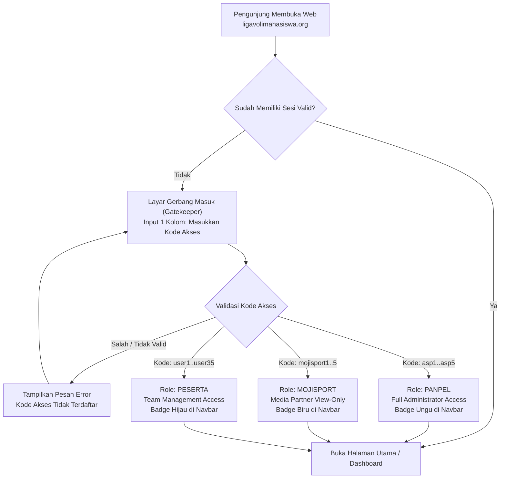

# DOKUMEN SPESIFIKASI ROLE-BASED PERMISSIONS (RBP)
## Sistem Gerbang Sandi & Pembatasan Hak Akses (45 Akun)
### Liga Voli Mahasiswa Nasional (LVM)

---

## 1. Ringkasan Eksekutif

Dokumen ini mendefinisikan rancangan arsitektur dan matriks hak akses (**Role-Based Permissions / RBP**) untuk pembatasan akses portal web resmi `ligavolimahasiswa.org`. Sistem ini menggunakan metode **Single-Field Gatekeeper Access Code** dengan total **45 kode akses** yang dibagi ke dalam **3 Peran (Role)**:

1. **Panpel (Panitia Pelaksana)**: 5 Kode (`asp1` s/d `asp5`)
2. **MojiSport (Official Broadcaster & Media Partner)**: 5 Kode (`mojisport1` s/d `mojisport5`)
3. **Peserta (Tim Universitas / Manajer Tim)**: 35 Kode (`user1` s/d `user35`)

---

## 2. Alur Akses Portal (Architecture Flow)

---

## 3. Matriks Hak Akses (Role-Based Permissions Matrix)

Tabel berikut menjabarkan secara rinci seluruh hak akses fungsional pada sistem:

| No | Modul & Fitur | Panitia Pelaksana (`asp1` - `asp5`) | MojiSport Media (`mojisport1` - `mojisport5`) | Tim Peserta (`user1` - `user35`) | Publik / Belum Login |
| :-: | :--- | :---: | :---: | :---: | :---: |
| **1** | **Akses Membuka Website** | ✅ Diizinkan | ✅ Diizinkan | ✅ Diizinkan | ❌ Terkunci (Gatekeeper) |
| **2** | **Dashboard Utama & Metrik Kuota** | ✅ Lihat Semua | ✅ Lihat Semua | ✅ Lihat Semua | ❌ Terkunci |
| **3** | **Lihat Daftar Semua Tim & Profil** | ✅ Lihat Semua | ✅ Lihat Semua | ✅ Lihat Semua | ❌ Terkunci |
| **4** | **Pendaftaran Tim Baru (`/register`)** | ✅ Bebas Daftar | ❌ Tidak Diizinkan | ✅ Sesuai Slot Akun | ❌ Terkunci |
| **5** | **Input & Edit Roster 20 Personel** | ✅ Semua 36 Tim | ❌ Read-Only (Hanya Lihat) | ✅ **Hanya Tim Sendiri** | ❌ Terkunci |
| **6** | **Unggah Foto Pemain & Official** | ✅ Semua Tim | ❌ Read-Only | ✅ **Hanya Tim Sendiri** | ❌ Terkunci |
| **7** | **Verifikasi Tim (Kunci Slot Resmi)** | ✅ **Penuh (Wewenang Panitia)** | ❌ Tidak Diizinkan | ❌ Tidak Diizinkan | ❌ Terkunci |
| **8** | **Batalkan Verifikasi / Buka Kunci** | ✅ Khusus Panitia | ❌ Tidak Diizinkan | ❌ Tidak Diizinkan | ❌ Terkunci |
| **9** | **Lihat Report 1 (Roster & Fisik)** | ✅ Lengkap | ✅ Lengkap | ✅ Lengkap | ❌ Terkunci |
| **10** | **Lihat Report 2 (Data Akademik/NIM)** | ✅ Lengkap | ✅ Lengkap | ⚠️ Terbatas | ❌ Terkunci |
| **11** | **Lihat Report 3 (Rekapitulasi Tim)** | ✅ Lengkap | ✅ Lengkap | ✅ Lengkap | ❌ Terkunci |
| **12** | **Lihat & Filter ID Card Peserta** | ✅ Semua Kartu | ✅ Semua Kartu | ✅ Semua Kartu | ❌ Terkunci |
| **13** | **Cetak Dokumen & Export ke PDF** | ✅ Diizinkan | ✅ Diizinkan | ✅ Diizinkan | ❌ Terkunci |
| **14** | **Export Data ke Format Excel (.xlsx)** | ✅ Diizinkan | ✅ Diizinkan | ❌ Dinonaktifkan | ❌ Terkunci |
| **15** | **Hapus Data Tim / Personel** | ✅ Khusus Panitia | ❌ Tidak Diizinkan | ❌ Tidak Diizinkan | ❌ Terkunci |

---

## 4. Rincian & Spesifikasi Tiap Peran

### 1. Role: Panitia Pelaksana (Panpel)
- **Daftar Kode Akses**: `asp1`, `asp2`, `asp3`, `asp4`, `asp5` (Total: 5 akun)
- **Tujuan**: Digunakan oleh tim teknis dan panitia pelaksana pertandingan untuk administrasi operasional.
- **Wewenang**:
  - Mengelola dan mengedit seluruh data pendaftaran dari seluruh 3 Regional (Barat, Tengah, Timur).
  - Melakukan validasi kelengkapan berkas akademik (KTM/PDDikti).
  - Menekan tombol **Verifikasi Tim (Kunci Slot)** yang mengunci data agar tidak dapat diedit kembali oleh peserta.
  - Membuka kembali kunci pendaftaran jika ada tim yang memerlukan perbaikan berkas.
  - Mengunduh rekapitulasi data lengkap dalam format Microsoft Excel dan PDF resmi ber-kop.

### 2. Role: MojiSport (Official Broadcaster & Media Partner)
- **Daftar Kode Akses**: `mojisport1`, `mojisport2`, `mojisport3`, `mojisport4`, `mojisport5` (Total: 5 akun)
- **Tujuan**: Digunakan oleh tim produksi siaran, komentator, grafis broadcast, dan jurnalis MojiSport.
- **Wewenang**:
  - Akses baca (*Read-Only*) ke seluruh informasi tim, nomor punggung/jersey, posisi bermain, tinggi & berat badan pemain.
  - Akses ke galeri ID card dan foto resmi atlet untuk kebutuhan grafis *line-up* tayangan televisi/live streaming.
  - Mengunduh lembar laporan resmi (PDF).
  - **Larangan**: Seluruh tombol mutasi data (Simpan, Edit, Hapus, Verifikasi) disembunyikan/dinonaktifkan secara otomatis.

### 3. Role: Peserta (Manajer Tim / Kampus)
- **Daftar Kode Akses**: `user1`, `user2`, `user3`, ... s/d `user35` (Total: 35 akun)
- **Tujuan**: Diberikan kepada perwakilan/manajer resmi dari masing-masing perguruan tinggi yang berpartisipasi.
- **Wewenang**:
  - Mengisi formulir pendaftaran dan mengunggah foto 20 personel (15 pemain dan 5 official) milik kampus mereka sendiri.
  - Melihat data tim lain dalam mode *view-only* untuk transparansi kompetisi.
  - **Isolasi Data**: Akun `userX` **tidak diizinkan mengubah, menghapus, atau menimpa** data roster tim kampus lain.
  - **Kunci Otomatis**: Setelah tim diverifikasi oleh Panitia (`Status: Terverifikasi`), form input otomatis terkunci dan tidak bisa diubah kembali oleh peserta.

---

## 5. Spesifikasi Teknis Implementasi

### A. Mekanisme Sesi & Keamanan
1. **Cookie Sesi Aman**:
   - Disimpan menggunakan cookie terenkripsi / HTTP cookie `lvm_access_session`.
   - Masa aktif sesi: **7 Hari** (pengguna tidak perlu memasukkan ulang kode setiap membuka tab baru).
2. **Validasi Tingkat Server (Server-Side Guard)**:
   - Selain proteksi di sisi antarmuka (UI), backend API (`/api/teams/*`, `/api/upload`) memvalidasi sesi secara ketat.
   - Request pengubahan data tanpa hak akses yang sah akan langsung ditolak dengan status HTTP `403 Forbidden`.

### B. Indikator Visual di Antarmuka
Pada bagian atas (Navbar), akan ditampilkan penanda identitas yang aktif:
- Panpel: `🛡️ Panpel (asp1)` dengan lencana ungu neon.
- MojiSport: `📺 MojiSport Media (mojisport1)` dengan lencana biru toska.
- Peserta: `🏐 Tim Peserta (user1)` dengan lencana hijau/pink.
- Tombol **"Keluar"** di samping nama akun untuk berganti kode akses.

---

## 6. Status Implementasi (11 September 2026)

Spesifikasi ini **sudah diimplementasikan penuh** di codebase. Rencana & status per task: `docs/08_RENCANA_IMPLEMENTASI_RBP.md`. Daftar kode siap cetak: `docs/09_DAFTAR_46_KODE_AKSES.md`.

Koreksi & keputusan yang menyimpang dari draf awal dokumen ini:
- Jumlah kode peserta **36** (`user1`–`user36`), bukan 35 → **total 46 kode**.
- Peserta **tidak dapat membuat tim sendiri** (baris 4 matriks di atas dibatalkan); pembuatan tim hanya oleh Panpel.
- Report 2 untuk Peserta = **hanya tim sendiri**.
- `ADMIN_SECRET_KEY`/PIN lama **dihapus total**; secret sesi baru `ACCESS_SESSION_SECRET`.
